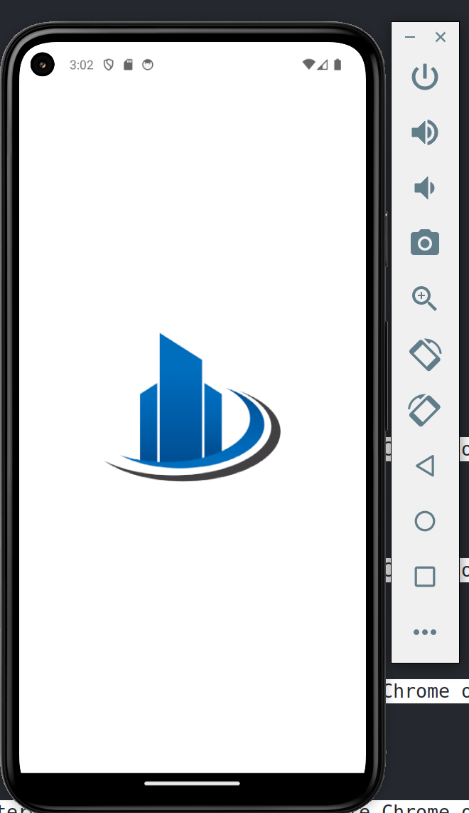
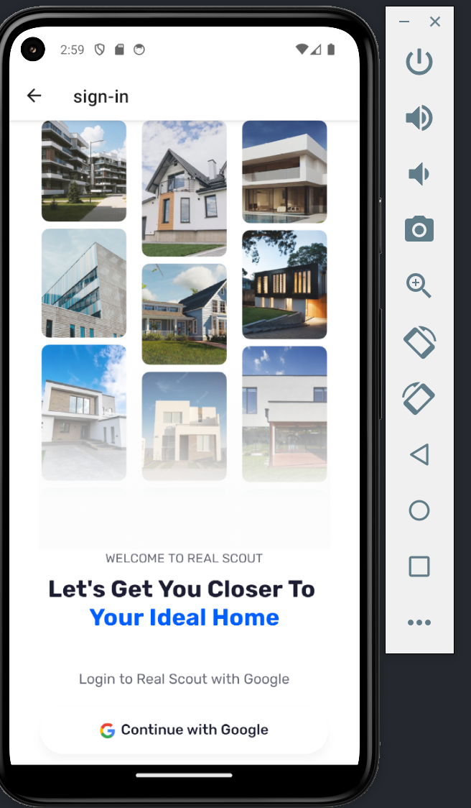

# 📱 ReState App

ReState is a modern **React Native** application designed to provide users with a seamless experience for finding their ideal home. Built with **React Native CLI**, it offers a smooth and interactive UI.

---

## ✨ Features
- 🏡 **Modern Onboarding Screen**
- 🔑 **Google Authentication**
- 📱 **Responsive UI with NativeWind/Tailwind**
- 🎨 **Beautiful UI & Dark Mode Support**
- 🚀 **Optimized Performance**

---

## 📷 Screenshots

| Onboarding | Login Page |
|------------|-----------|
|  |  |


---

## 🛠 Installation

### 1️⃣ **Clone the Repository**
```sh
 git clone https://github.com/AlanMelendez/restate-app.git
 cd restate-app
```

### 2️⃣ **Install Dependencies**
```sh
npm install
```

### 3️⃣ **Run on Android Device/Emulator**
```sh
npx react-native run-android
```
or if you using pnpm

```sh
pnpm react-native run-android
```

### 4️⃣ **Run on iOS (Mac only)**
```sh
npx pod-install
npx react-native run-ios
```

---

## 🔧 Configuration
### **Google Authentication Setup**
To enable Google Login, configure your Firebase project and replace the necessary API keys in the app.

1. Go to **AppWrite** → Add a project.
---

## 🤖 Development
### **Directory Structure**
```
restate-app/
├── android/      # Android native code
├── ios/          # iOS native code
├── src/          # Main application code
│   ├── assets/   # Images, icons, and other static files
│   ├── components/  # Reusable UI components
│   ├── screens/  # App screens
│   ├── styles/   # Styling and theme configuration
│   ├── utils/    # Helper functions
│   └── App.js    # Root component
├── package.json  # Dependencies
└── README.md     # Project documentation
```

---

## 📌 Contributing
Contributions are welcome! If you’d like to contribute, please fork the repository and submit a pull request.

```sh
git checkout -b feature/new-feature
```

---

## 📜 License
This project is licensed under the **MIT License**.

---

## 👨‍💻 Author
**Alan Dev**  
🚀 GitHub: [@your-username](https://github.com/your-username)  
✉️ Email: your-email@example.com

